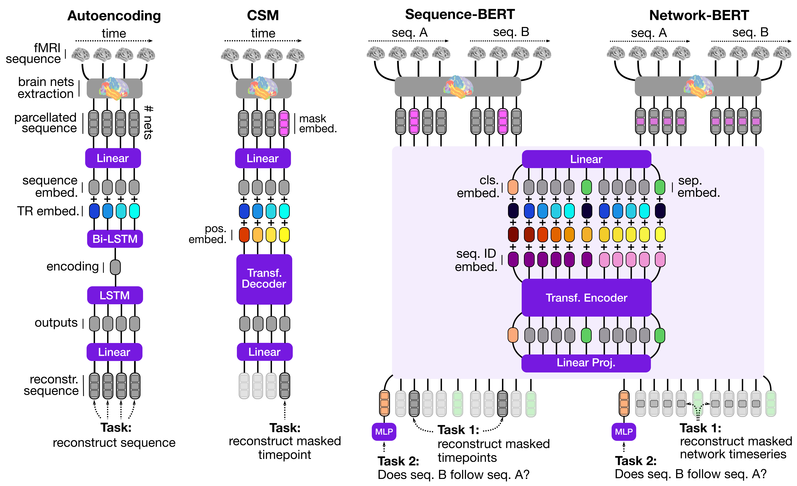

# Self-supervised learning of brain dynamics from broad neuroimaging data

This repository contains the code and data underlying our recent preprint:

Thomas, A. W., Ré, C., & Poldrack, R. A. (2022). Self-Supervised Learning Of Brain Dynamics From Broad Neuroimaging Data. arXiv preprint [arXiv:2206.11417](https://arxiv.org/abs/2206.11417).


## About



Self-supervised learning techniques are celebrating immense success in natural language processing (NLP) by enabling models to learn from broad language data at unprecedented scales. Here, we aim to leverage the success of these techniques for mental state decoding, where researchers aim to identify specific mental states (such as an individual’s experience of anger or happiness) from brain activity. To this end, we have devised a set of novel self-supervised learning frameworks for neuroimaging data based on prominent learning frameworks in NLP. At their core, these frameworks learn the dynamics of brain activity by modeling sequences of activity akin to how NLP models sequences of text. 

Specifically, we propose the following four learning frameworks:
- **Autoencoding**: The autoencoding framework is inspired by recurrent sequence-to-sequence neural machine translation models. These models take as input some text sequence, encode this sequence in a lower-dimensional representation, and predict an output sequence from the lower-dimensional encoding (e.g., a translation of the original input text to another language). We use a recurrent autoencoder based on the LSTM architecture (see [src/decoder/autoencoder.py](src/decoder/autoencoder.py)).
- **Causal Sequence Modeling (CSM)**: The causal sequence modeling (CSM) framework is inspired by recent advances in [causal language modeling](https://proceedings.neurips.cc/paper/2020/hash/1457c0d6bfcb4967418bfb8ac142f64a-Abstract.html), where models are trained to predict the next word in a sequence of text. In line with this work, we utilize a standard Transformer decoder model architecture (see [src/decoder/gpt.py](src/decoder/gpt.py)).
- **Sequence-BERT**: The Sequence-BERT framework is based on recent advances in bidirectional masked language
modeling, particularly [BERT](https://arxiv.org/abs/1810.04805). Accordingly, Sequence-BERT trains a standard Transformer encoder model architecture (see [src/decoder/bert.py](src/decoder/bert.py)) in two objectives, namely, the reconstruction of masked time points in the input BOLD sequences and the prediction whether the two input sequences that create each input sample follow on one another in the same underlying fMRI run. 
- **Network-BERT**: A variant of the Sequence-BERT framework that masks the values of individual networks over time instead of masking all network values of individual time points (see the manuscript for details). 


## Project organization

Find below an overview of the repository organization: 

```bash
├── Dockerfile                <- Details on building Docker image
├── poetry.lock               <- Details on used Python packages for Python poetry
├── pyproject.toml            <- Specifics on installed Python packages with Python poetry
├── requirements.txt          <- Details on used Python packages for pip install 
├── README.md                 <- This README file
├── .gitignore                <- Files that git should ignore
├── .gitattributes            <- Assigns attributes to path names
|
├── configs/
|    └──deepspeed/            <- Configuration files for deepspeed (used to accelerate GPU training)
|
├── data/
|    ├──upstream/             <- Directory containing upstream datasets;
|    |                           Each dataset contains one .tar file for each of its fMRI runs
|    └──downstream/           <- Directory containing the two downstream datasets
|
└── scripts/
|    ├── train.py             <- Main script used for up- and downstream training of models
|    ├── analyses/            <- Scripts used to create Figures of our preprint
|    └── dataprep/            <- Scripts to generate of .tar files stored in `data/`
|
├── src/
|    ├── __init__.py          <- Initializes 'src/' module
|    ├── batcher/             <- Functionality to build Pytorch datasets from .tar-files in data/
|    ├── decoder/             <- Core model architectures used for learning
|    ├── embedder/            <- Embedding of input parcelated BOLD sequences into embedding space; Adding of training tokens to input; Masking of inputs during training; Computation of training losses
|    ├── tools/               <- Several helper tools to visualize brain maps, grab .tar-files, plot DL model architectures, and configure wandb
|    ├── trainer/             <- Trainer functionality; inherits Trainer object from HuggingFrace transformers library
|    ├── model.py             <- Builds full model from initialized embedder, decoder, and unembedder objects
|    ├── preprocessor.py      <- Additional preprocessing of fmriprep derivatives
|    └── unembedder.py        <- Un-embedding of predicted output sequences back to input space
|
└── tests/                    <- A collection of basic tests for `src/` module
|
└── results/
|    ├── figures/             <- Figures included in our preprint
|    └── models/              
|          └── upstream       <- Pre-trained models as described in preprint
```


## Data

Please download the data from [figshare](https://figshare.com/projects/Self-Supervised_Learning_of_Brain_Dynamics_from_Broad_Neuroimaging_Data/172176) and place them in the directory structure shown above.

We use [WebDataset](https://github.com/webdataset/webdataset) to read data during training. To this end, we have converted each fMRI run of the included datasets to a .tar file with the following attributes:

**Upstream:** All upstream data contain three core entries for I) the parcelated BOLD data (`bold.pyd`), II) its repetition time (`t_r.pyd`), and III) a key (`__key__`) indicating the specific subject / task / run that this .tar file corresponds to. 

**Downstream:** Each .tar file of the two downstream datasets contains one sample for each trial of its experiment run. In addition to the three entries listed for the upstream data, each trial also contains information describing the associated mental state. In our downstream adapatation analyses, we utilize the `task_label.pyd` (MDTB data) and `label_across_tasks.pyd` (HCP data) entries to assign numerical labels to each mental state during training. Note that the MDTB data is indicated with its OpenNeuro identifier (`ds002105`) in the `data/downstream/` directory. 

For details on the additional preprocessing applied to [fmriprep](https://fmriprep.org/en/stable/)'s derivatives for each dataset, see the scripts contained in `scripts/dataprep/`.


## Installation 

This repository provides three main ways to install all required dependencies:

- [Python Poetry](https://python-poetry.org/) with the provided [pyproject.toml](pyproject.toml) and [poetry.lock](poetry.lock) files.
- [Docker](https://www.docker.com/) with the provided [Dockerfile](Dockerfile)
- [pip](https://pypi.org/project/pip/) with the provided [requirements.txt](requirements.txt) file

Our code relies **heavily** on [PyTorch](https://pytorch.org/) and the [HuggingFace transformers](https://huggingface.co/docs/transformers/index) library.


## Basic usage

Each script in the [scripts/](scripts/) directory contains a `get_args()` function that specifies all of its command line arguments.

For example, you can adapt our [pre-trained GPT architecture](results/models/upstream/GPT_lrs-4_hds-12_embd-768_train-CSM_lr-0005_bs-192_drp-01) to the MDTB dataset by running:

```bash
python3 scripts/train.py \
    --data 'data/downstream/ds002105' \ #ds002105 represents the dataset's OpenNeuro identifier
    --n-train-subjects-per-dataset 11 \
    --n-val-subjects-per-dataset 3 \
    --n-test-subjects-per-dataset 9 \
    --architecture 'GPT' \
    --pretrained-model 'results/models/upstream/GPT_lrs-4_hds-12_embd-768_train-CSM_lr-0005_bs-192_drp-01/model_final/pytorch_model.bin' \
    --training-style 'decoding' \
    --decoding-target 'task_label.pyd' \
    --num-decoding-classes 26 \
    --training-steps 10000 \
    --per-device-training-batch-size 64 \
    --learning-rate 1e-4 \
    --log-dir 'results/models/downstream/ds002105' \
    --log-every-n-steps 1000
```

Specifically, this will train the model on the data of 11 individuals contained in `data/downstream/ds002105`, while using the data of 3 and 9 other individuals for validation and testing respectively. During training, the model will learn to decode the 26 mental state labels encoded in the `task_label.pyd` entries of the data .tar files from the respective `bold.pyd` data of the same files. The model will be trained for 10,000 training steps at a mini-batch size of 64 samples per used training device (ie., GPU) at a learning rate of 1e-4 with the [AdamW](https://huggingface.co/docs/transformers/main_classes/optimizer_schedules) optimizer of the [HuggingFace transformers](https://huggingface.co/docs/transformers/index) library. At every 1000th training step, the model's performance will be evaluated and stored in the specified `--log-dir`.


## Pre-trained models

Please download the pre-trained models from [figshare](https://figshare.com/projects/Self-Supervised_Learning_of_Brain_Dynamics_from_Broad_Neuroimaging_Data/172176) and place them in `results/models` as shown in the directory structure above.

## When you encounter issues

This code was written by a single person as a research project; not by a team of software engineers!

I am currently still in the process of setting-up / testing this repository; cleaning up the code has likely introduced minor bugs here and there. 

If you encounter any of these bugs, please open a respective GitHub Issue; I will do my best to fix them in time!
